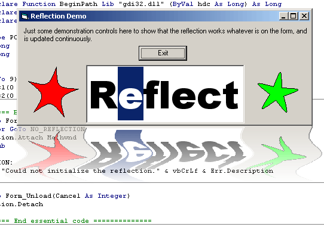



## Animated, shimmering form reflection effect

### Description

This code creates a semi-transparent reflection of your form which shimmers in realtime. The screenshot shows the basic idea, but it looks much better animated!

It uses the UpdateLayeredWindow() API, so will only work on 2k/XP. I have only tested it on XP.

It can use quite a bit of CPU (especially while moving or sizing the form) but could be a nice feature on an about box or something.

Parts of the code are optimized, others are not. It could easily be improved upon, and I welcome any suggestions you might have.

The effect subclasses your form. To keep the code simple, I have not used ASM-thunking as I usually do, so if you run it in the IDE: DO NOT press the stop button, and DO NOT try and debug-step through the subclassed WindowProc. If you avoid doing this it will run in the IDE quite nicely.

There is one "feature" that occurs when the form is near the left edge of the screen : the wave is shunted to the right. I don't know why, if you do, tell me!

Some routines were adapted from the vbaccelerator article at http://www.vbaccelerator.com/home/vb/code/libraries/Graphics_and_GDI/Drop_Shadows/article.asp
 
### More Info
 

             |
---                |---
**Submitted On**   |2006-08-01 07:50:02
**By**             |[grigri](https://github.com/Planet-Source-Code/PSCIndex/blob/master/ByAuthor/grigri.md)
**Level**          |Advanced
**User Rating**    |5.0 (115 globes from 23 users)
**Compatibility**  |VB 6\.0
**Category**       |[Graphics](https://github.com/Planet-Source-Code/PSCIndex/blob/master/ByCategory/graphics__1-46.md)
**World**          |[Visual Basic](https://github.com/Planet-Source-Code/PSCIndex/blob/master/ByWorld/visual-basic.md)
**Archive File**   |[Animated\_\_201018812006\.zip](https://github.com/Planet-Source-Code/grigri-animated-shimmering-form-reflection-effect__1-66153/archive/master.zip)

